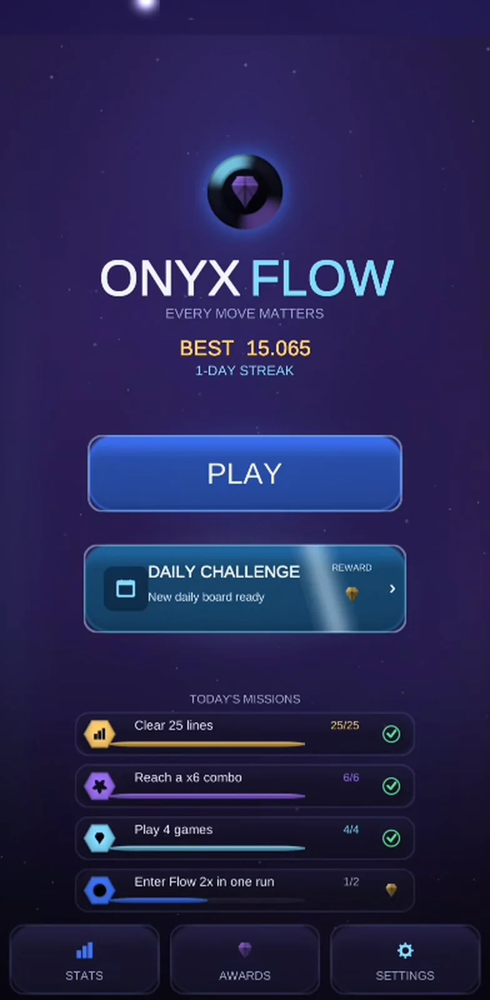
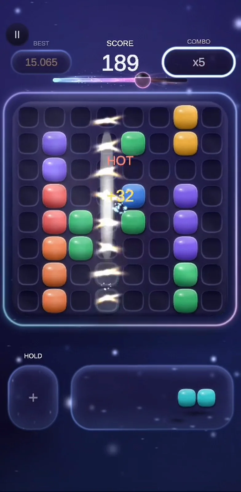
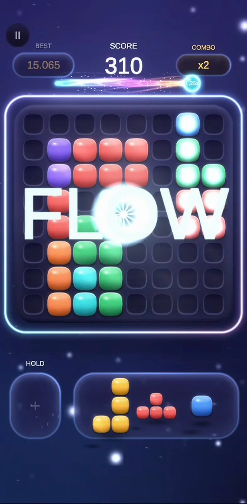
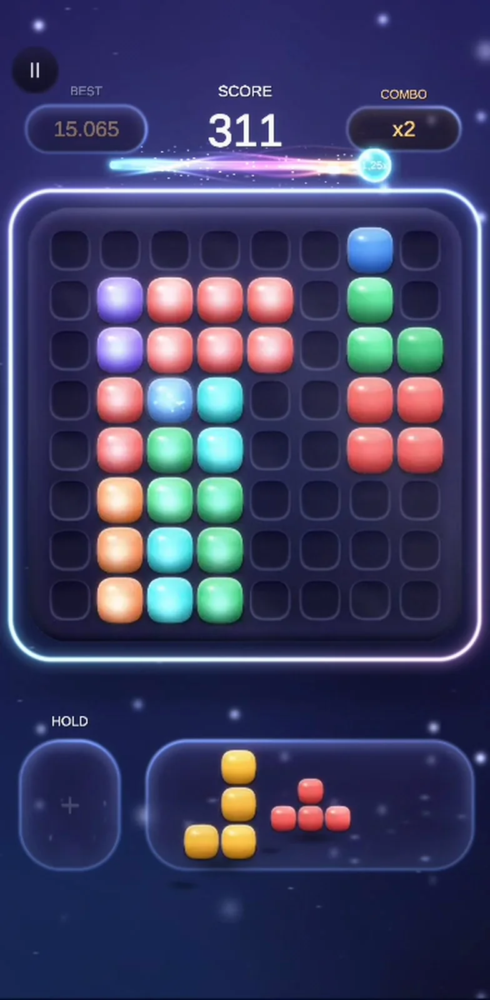

# Onyx Flow

**A premium block puzzle for Android — designed, engineered and published solo.**
Clear lines to charge the Flow meter, hold it with clean play, and every point you score is multiplied.
No timers, no lives, no paywalls.

**[Get it on Google Play](https://play.google.com/store/apps/details?id=com.portaldesignstudio.onyxflow)** ·
**[Website](https://portalstudiodesign.github.io/onyx-flow-site/)**

  
  
  
  

> The game's source code is private because Onyx Flow is a commercial product.
> This page explains how it is built; I'm happy to walk through the code in an interview.

---

## At a glance

| | |
|---|---|
| **Engine / language** | Unity 6 · C# · Android |
| **Team** | Solo — design, engineering, visual direction, audio, monetisation, store release |
| **Art** | Generated procedurally at runtime — no stock or Asset Store art |
| **Size / performance** | 33 MB download · 60 FPS on mid-range Android (tested on a Samsung Galaxy A25) |
| **Monetisation** | Google AdMob, with the advertising-consent prompt from Google's UMP SDK |
| **Tests** | 150+ NUnit tests on the game rules, runnable without opening Unity |

## Architecture

The game rules know nothing about Unity. They live in assemblies compiled with `noEngineReferences`, so the
compiler itself stops engine code leaking into the logic — and the rules can be tested in milliseconds.

| Assembly | Responsibility | Depends on | Uses Unity? |
|---|---|---|---|
| `Nova.Core` | Value types: grid positions, piece shapes, scoring settings | — | **No** (`noEngineReferences`) |
| `Nova.Domain` | The rules: board, placement, line clears, combos, Flow, scoring, game session | Core | **No** (`noEngineReferences`) |
| `Nova.Data` | ScriptableObject configuration | Core | Yes |
| `Nova.Gameplay` | Presentation: input, views, procedural art, audio, UI | Core, Domain, Data | Yes |
| `Nova.DevSandbox` | Developer tools — editor and development builds only | Core, Domain, Data, Gameplay | Yes |
| `Nova.Tests.EditMode` | NUnit tests of the rules | Core, Domain | Test runner only (editor) |

## Engineering highlights

**Deterministic by design.** Piece generation is seeded and every move goes through the pure domain layer, so
a game is fully described by *seed + list of moves*. Daily challenges derive their seed from the date — every
player gets the same puzzle — and any saved run can be replayed move for move, which also makes bugs
reproducible from a single report.

**Procedural visual identity.** Every block, particle, effect and all four board finishes (Classic,
Glassmorphism, Neon, Holographic) are generated in code at runtime. That keeps the download at 33 MB,
guarantees a coherent style, and made iterating on the look a code change instead of an art pipeline.

**The Flow mechanic.** The signature system rewards *clean* play: Flow charges only from line clears, weighted
by how much open, connected space the player leaves on the board, and decays with every move. Holding it
multiplies every point scored — so the game rewards thinking ahead, not just clearing lines.

**A developer sandbox built in.** A separate assembly adds an in-game overlay (F1) with cheats, a profiler,
stress tests, seed control, replay and state validation — used for tuning and for chasing frame drops on real
devices. It compiles only into editor and development builds (`UNITY_EDITOR || DEVELOPMENT_BUILD`), so none of
it ships to players.

**Shipping, not just building.** Closed testing with 25 testers for 14 days (Google Play's requirement for new
developer accounts), a public privacy policy, a Data Safety form that matches what AdMob actually collects,
and a consent flow for EEA/UK players.

## Features

Hold slot · tiered combos · Flow multiplier · daily challenges · daily missions · 17 achievements ·
statistics and streaks · four board finishes · plays offline, no account needed.

---

Made by **Adrian Iulian Antal** — [GitHub](https://github.com/portalstudiodesign) ·
[LinkedIn](https://www.linkedin.com/in/antal-adrian-iulian/)

*Maintaining the website in this repository: see [MAINTAINING.md](MAINTAINING.md).*
